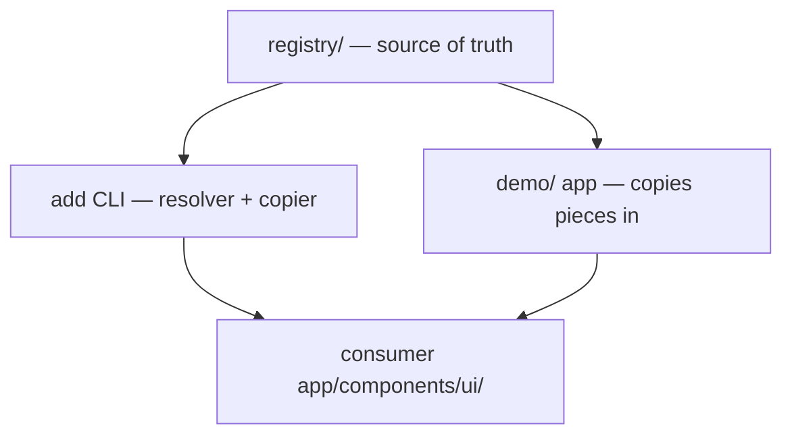

# Registry-to-consumer topology

The repo has one source of truth (`registry/`) and two downstream consumers: the in-repo demo app today, and any external Puzzle app once the [[FEATURE-ADD-CLI]] ships. Nothing *imports* puzzle-pieces — pieces are copied source.

The demo is hand-synced from `registry/` today (edit registry first, copy the file into `demo/app/components/ui/` — see CLAUDE.md topology rules). The [[FEATURE-ADD-CLI]] will automate the same copy for external apps. Both paths are the copy-in model of [[DECISION-COPY-IN-DISTRIBUTION]]; the registry shape that makes the CLI a pure copier is [[DECISION-REGISTRY-SHAPED-REPO]].
